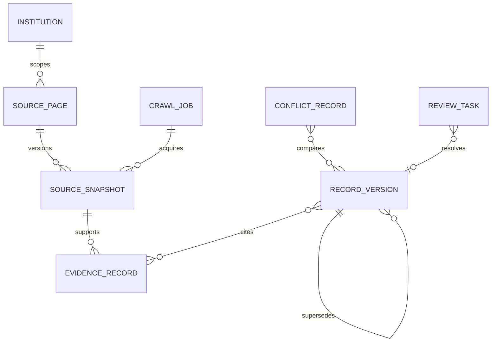

# Ingestion data model

## Evidence and source lineage

`Institution` owns configured campus/domain scope. A `SourcePage` is the canonical identity of an
official page. Each fetch creates or reuses an immutable `SourceSnapshot`, identified by SHA-256
content hashes and a durable location. `EvidenceRecord` points to one snapshot and carries the exact
supporting text plus structural context.

Raw page bytes are not stored in normalized record payloads or exports. Snapshot metadata stores a
content location and hashes; retention/storage policy controls the actual bytes.

## Normalized records

- `Course`: canonical subject/number, title/description, credit range/type, prerequisite/corequisite
  references, restrictions, repeatability, equivalencies, overlaps, designators, and offering notes.
- `Program`: official name, degree/school/department, admission type/path, capacity, application
  details, GPA, requirements, and source scope.
- `Requirement`: typed scope, recursive expression reference, credit/course/grade floors, allowed
  courses, double-counting/residency rules, and mandatory/recommended flags.
- `AdmissionsRule`: applicant type, rule type/value, timing, audience, and conditions.
- `TransferPolicy`: source institution/course scope, credit limit, applicability, standing effect,
  conditions, and exceptions.
- `ExamCreditRule`: exam/score band, aligned course-credit awards, designators, placement, duplicate
  credit/native-speaker rules, major applicability, and notes.

Every evidence-backed record also carries effective dates, parser identity/version, warnings,
unresolved fields, authority, deterministic confidence tier, and review status.

## Requirement expressions

Prerequisites and requirements are recursive nodes rather than flattened text. Supported nodes cover
all/any groups, courses, minimum grades, concurrency, placement, permission, standing, program and
college restrictions, credit/GPA thresholds, conditions, and raw unresolved fragments. Evaluation is
three-state: unresolved evidence is never treated as false.

## Versions, conflicts, and review

Publication computes a canonical key and content hash. Identical payloads are idempotent. A changed
payload appends a new `RecordVersion` and marks the prior version superseded; evidence remains intact.

Conflict detection groups claims by canonical identity, compares substantive fields, and only treats
overlapping effective periods as conflicts. It records every differing field, authority, effective
period, and suggested review action. Confidence scoring exposes factor-level explanations and cannot
be assigned by a model. Missing exact evidence, invalid schema/logic, ambiguity, unresolved fields,
material change, and conflicts can block publication or require review.

