# Typed ingestion pipeline

```mermaid
flowchart LR
    A["Configured seeds or local fixture"] --> B["Access policy and robots"]
    B --> C["Safe fetch or fixture read"]
    C --> D["Canonical page and immutable snapshot"]
    D --> E["Page classification"]
    E --> F["Deterministic adapter"]
    F -->|"unsupported structure only"| G["Injected structured extraction fallback"]
    F --> H["Exact evidence verification"]
    G --> H
    H --> I["Normalization and schema validation"]
    I --> J["Logical validation"]
    J --> K["Field-level conflict detection"]
    K --> L["Deterministic confidence scoring"]
    L --> M{"Publishable?"}
    M -->|"yes"| N["Transactional append-only version"]
    M -->|"no"| O["Human review task"]
```

Each stage accepts and returns typed values. Page processing is isolated: a malformed page adds a
structured error and increments failure metrics but does not terminate the crawl job.

## Acquisition boundary

`SafeFetchClient` enforces configured HTTPS hosts, rejects IP literals and private/non-global DNS
results, manually validates redirect destinations, applies host rate limits, bounds response size and
content type, supports retries/ETags, and defaults to network disabled. Inspection fetches robots.txt
through the same boundary and fails closed if it cannot establish policy.

HTML, PDF, JSON, CSV, XML, and plain text may be accepted when configured; fetched bytes remain
untrusted. Parsers use bounded input and do not execute scripts.

## Deterministic extraction and model fallback

Known UW structures always use deterministic adapters first. The `StructuredExtractionClient`
protocol supports classification, course-requirement extraction, requirement parsing, policy
extraction, source comparison, and unresolved-issue summaries. Tests inject
`FakeStructuredExtractionClient` and require no credentials.

The optional OpenAI client uses the Responses API structured-output parser with a strict Pydantic
schema. It receives only configured institution/campus/source context, bounded cleaned text,
structured tables, relevant DOM blocks, and known deterministic fields. It cannot browse, add a URL,
guess an equivalency, override deterministic fields silently, or assign final confidence. Every
returned quote passes the same snapshot evidence gate before the proposal can continue.

## Publication and failure behavior

The publisher validates the entire batch, detects conflicts, scores confidence, persists review tasks,
stores evidence rows, appends record versions, and commits once. An exception rolls the transaction
back. Missing evidence never produces a partially published record.

`PipelineResult` returns records, warnings, errors, skipped items, review tasks, discovered links,
snapshots, and parser metrics. Structured logs contain IDs, counts, and issue codes—not page bodies,
credentials, or full model inputs.
