# UW Seattle Academic Ingestion Framework Design

**Date:** 2026-07-16
**Status:** Approved for implementation
**Branch:** `andrew`

## Purpose

Build the first production-quality, university-specific data acquisition service for Pathwise. The service will ingest a bounded but representative set of official University of Washington Seattle academic sources while preserving exact evidence, uncertainty, policy scope, effective periods, and historical versions.

This work adds a backend data platform. It does not replace the existing Next.js prototype or implement the full student-facing planning product.

## Binding Requirements

The implementation follows, in priority order:

1. The attached UW Seattle implementation request.
2. `docs/gpt56_academic_planning_os_build_spec.md` for product behavior and trust requirements.
3. `docs/academic_planning_data_scraping_spec.pdf` for acquisition, evidence, confidence, conflict, and uncertainty principles.

The two upstream specification files currently exist at the repository root. The implementation will place canonical copies at the required `docs/` paths without changing their contents.

## Delivery Strategy

Use a vertical production slice rather than a broad crawler or an infrastructure-only foundation. Each milestone will leave a testable end-to-end capability:

1. Typed models, evidence, persistence, migrations, and versioning.
2. Safe discovery, fetching, canonicalization, and immutable snapshots.
3. Deterministic UW course, major, transfer, and AP adapters.
4. Conservative prerequisite and requirement expressions.
5. Evidence validation, conflict detection, confidence scoring, and review routing.
6. Orchestration, API endpoints, command-line tools, documentation, and fixture ingestion.

The Time Schedule adapter is enabled only when current robots rules and public page behavior permit it. The Equivalency Guide receives discovery and snapshot support only when it is public, unauthenticated, permitted, and stable enough to test. Neither source may block the core delivery.

## Repository Architecture

The repository remains a monorepo with two independently runnable applications:

- The existing Next.js application remains the student-facing prototype.
- A new Python 3.12 FastAPI service under `src/academic_ingest/` owns institutional source ingestion and structured academic policy data.

Root-level Python tooling will include `pyproject.toml`, `alembic.ini`, Alembic migrations, Docker Compose, scripts, and tests. Existing TypeScript service contracts remain unchanged in this iteration; later integration can replace their mock policy-retrieval implementation with HTTP calls to FastAPI.

PostgreSQL is the authoritative production database. SQLAlchemy models use portable types where practical so default tests can run entirely offline with an isolated local database. Alembic and production-specific behavior are separately verified against PostgreSQL through Docker Compose.

## Core Module Boundaries

### Configuration

`academic_ingest.config` loads settings and institution definitions. `config/institutions/uw_seattle.yaml` defines official domains, disallowed campuses, seed URLs, policy families, request limits, and parser options. A crawler contact address is required only for live network mode and comes from `ACADEMIC_INGEST_CONTACT_EMAIL`.

### Discovery

`academic_ingest.discovery` handles robots rules, sitemap inspection, bounded link discovery, canonical URLs, and source-map metadata. Discovery returns candidate sources; it never parses or publishes policy facts.

### Fetching

`academic_ingest.fetching` enforces HTTPS, domain allowlists, campus exclusions, redirect validation, response-size limits, content-type restrictions, robots decisions, conservative per-host rate limits, bounded retries, exponential backoff, and caching. Live access is disabled unless the caller explicitly enables it.

### Snapshots

`academic_ingest.snapshots` stores immutable raw bytes in a content-addressed filesystem and stores retrieval metadata in PostgreSQL. Raw and normalized hashes are distinct. A repeated identical response reuses content bytes but records the crawl observation idempotently. A changed response creates a new snapshot and change event; earlier snapshots are never modified.

### Classification and Adapter Registry

Classification assigns source type, policy family, campus scope, and likely adapter from URL and deterministic page features. The registry selects a focused adapter through `matches(page)` and `extract(context)` interfaces. No adapter performs network access itself.

### UW Adapters

The UW package contains separate adapters for:

- Course glossary
- Course catalog subject pages
- Majors index
- Major detail pages
- Transfer admissions
- Transfer-credit policies
- AP credit
- Time Schedule observations, when allowed
- Equivalency Guide discovery/snapshots, when allowed

Adapters return typed candidate records plus evidence spans, warnings, unresolved fields, parser metrics, and discovered links. One malformed block or page is isolated and routed to review without terminating the crawl job.

### Extraction Fallback

`StructuredExtractionClient` defines strict methods for classification, requirement parsing, policy extraction, source comparison, and unresolved summaries. `FakeStructuredExtractionClient` supports offline tests. `OpenAIStructuredExtractionClient` uses the official OpenAI Python SDK and strict Pydantic structured outputs.

The model receives only a bounded source bundle supplied by the pipeline. It cannot browse, add URLs, invent missing fields, select final confidence, or silently replace deterministic output. Every proposed quotation must be found in the supplied snapshot after conservative whitespace normalization.

### Normalization and Requirement AST

Normalization standardizes institution, campus, term, subject, course number, and canonical identifiers without discarding original text.

Prerequisites and requirements use a recursive typed AST supporting `COURSE`, `ALL_OF`, `ANY_OF`, `CHOOSE_N`, `SEQUENCE`, `MINIMUM_GRADE`, `CONCURRENT`, `PLACEMENT`, `PERMISSION`, standing and scope restrictions, credit/GPA thresholds, conditional logic, and `RAW_UNRESOLVED`. Partial parses retain recognized structure and unresolved source fragments. Serialization, rendering, validation, and conservative evaluation operate on the same AST.

### Validation, Conflicts, Confidence, and Review

Validation is deterministic and separates rejected records, warnings, and review tasks. Publishing is denied when a fact lacks exact evidence or violates a critical scope or logic invariant.

Conflict detection compares overlapping official claims without merging them. Both claims remain versioned and evidence-backed. A conflict record identifies differing fields, sources, authority categories, effective periods, archive signals, and the review question.

Confidence scoring stores explainable factor values for authority, scope, evidence, effective-period clarity, parser mode, validation, conflicts, ambiguity, freshness, and archive status. GPT never assigns final confidence. Tiers are `verified`, `high_confidence`, `needs_review`, `unresolved`, and `deprecated`.

Review tasks preserve unresolved questions and reviewer decisions. Resolution adds an auditable decision and never deletes or rewrites original evidence.

### Publishing

Publishing accepts only validated candidates with required evidence. Domain records are append-versioned. New material versions supersede current records while historical versions remain queryable. Current-record repository methods select the latest non-superseded version for an effective period.

## Data Model

Pydantic v2 domain models and corresponding SQLAlchemy 2 tables cover:

- Institution and CatalogVersion
- CrawlJob, SourcePage, SourceSnapshot, and SourceChangeEvent
- EvidenceRecord
- Course and CourseOfferingObservation
- Program and Requirement
- AdmissionsRule and TransferPolicy
- ExamCreditRule
- RequirementExpression
- ConflictRecord and ReviewTask
- RecordVersion and confidence-factor details

Complex policy content is normalized relationally where it is queried or versioned independently. JSON/JSONB is limited to source headers, warnings, conditions, factor details, and adapter-specific intermediate metadata.

The model maintains distinct outcomes for transferability, direct equivalency, general education, major applicability, degree applicability, enrollment prerequisites, application eligibility, class standing, graduation credit, elective credit, mapping not found, and explicit no credit.

## Pipeline Data Flow

```mermaid
flowchart LR
    A["Seed URLs"] --> B["Discovery"]
    B --> C["Robots and access policy"]
    C --> D["Safe fetch and cache"]
    D --> E["Canonical source page"]
    E --> F["Immutable snapshot"]
    F --> G["Classification"]
    G --> H["Deterministic adapter"]
    H --> I["Bounded GPT fallback"]
    I --> J["Evidence verification"]
    J --> K["Normalization"]
    K --> L["Schema and logical validation"]
    L --> M["Conflict detection"]
    M --> N["Deterministic confidence"]
    N --> O{"Publishable?"}
    O -->|Yes| P["Versioned publishing"]
    O -->|No or uncertain| Q["Review task"]
```



Every stage accepts typed input and returns typed output. The aggregate `PipelineResult` contains records, warnings, errors, skipped items, review tasks, discovered links, source snapshots, and parser metrics.

## UW Representative Scope

The bounded UW sample targets:

- All discoverable CSE and INFO Seattle catalog descriptions when permitted and reasonably bounded.
- MATH 124, MATH 125, MATH 126, STAT 311, and ENGL 131.
- Computer Science, Computer Engineering, Informatics, Statistics, and Mathematics.
- Data Science only when an official source identifies it as a distinct undergraduate program or option; its official classification is preserved.
- Transfer overview, application process and applicant-type rules, transfer-credit policies, admission-to-major classifications, major-type definitions, AP credit, and general-education terminology.

Offline fixtures are concise structural representations, not fabricated real policy records. Fixture records are labeled synthetic. Live records are published as official only after successful retrieval, exact evidence validation, scope validation, and confidence assignment.

## API and Command-Line Interfaces

FastAPI exposes the required crawl-job, fixture-ingestion, source, course, program, admissions-rule, transfer-policy, exam-credit, conflict, review-task, and health endpoints. List endpoints support the specified filters. Detail endpoints include evidence and version history.

The scripts provide:

- Bounded source inspection with no policy persistence by default.
- Fixture-only sample ingestion by default and explicit `--allow-network` live mode.
- JSON export containing schema version, export time, normalized records, and evidence while excluding secrets and raw binary snapshots.

## Failure and Safety Behavior

- A page failure is recorded on its crawl job and does not stop unrelated pages.
- Robots denial, disallowed campus, unsafe redirect, unsupported content type, excessive response size, and authentication boundaries produce explicit skipped results.
- Bothell and Tacoma pages cannot be published as Seattle records.
- Missing effective-period context lowers confidence or creates review rather than borrowing a current date.
- Footnoted rows without captured footnotes cannot be published as verified.
- Mapping-not-found can never be normalized to no-credit.
- Course offering observations never imply future availability.
- Untrusted HTML is parsed as data; scripts are never executed.
- Logs contain structured identifiers and metrics, not raw page bodies, secrets, or student data.

## Testing Strategy

Development follows test-driven cycles: write one behavioral test, observe the expected failure, implement the smallest passing behavior, and refactor only while green.

Default tests are offline and use concise HTML/PDF fixtures, mocked HTTP responses, a fake extraction client, temporary snapshot storage, and an isolated database. Unit tests cover all requested parsing, access-control, hashing, AST, evidence, confidence, conflict, idempotency, versioning, and semantic-distinction cases. Integration tests exercise each representative adapter, pipeline publication and review routing, version retention, fake GPT fallback, and API retrieval.

A publication invariant test fails if any published course prerequisite, requirement, admissions rule, transfer policy, or exam-credit rule lacks valid evidence.

Completion verification runs:

```text
ruff check .
ruff format --check .
mypy src
pytest
alembic upgrade head
python scripts/ingest_uw_sample.py --fixture-only
python scripts/export_uw_records.py --output <platform-safe-temp-path>/uw-records.json
```

PostgreSQL migration verification runs against the Docker Compose service. Live source inspection and ingestion are reported separately and never implied by fixture success.

## Documentation and Operations

The implementation updates the README and adds source-map, UW-adapter, data-model, pipeline, institution-extension, safety/compliance, and contributor-agent documentation. The UW source map records inspection time, robots decisions, canonical metadata, adapter choice, authority, campus scope, effective-date signals, dependencies, and limitations.

Structured logging and metric hooks cover crawl, fetch, cache, parse, fallback, evidence failure, publishing, conflicts, review tasks, and material source changes.

## Explicit Non-Goals

This iteration does not:

- Replace the Next.js mock planning experience with production calls.
- Crawl every UW course, program, campus, or historical catalog.
- Scrape authenticated, NetID-only, CAPTCHA-protected, or private systems.
- Treat the Equivalency Guide as parseable unless its public format proves stable.
- Use historical Time Schedule observations as future guarantees.
- Implement transcript parsing, personalized transfer decisions, degree audits, admissions predictions, or course recommendations.
- Publish an LLM interpretation without exact official evidence.

## Completion Standard

The work is complete only when the reusable pipeline, UW adapter package, database migration, representative offline ingestion, API, scripts, documentation, and all required validation commands pass. Any inaccessible source, unresolved interpretation, missing live database capability, or partially implemented adapter is reported explicitly rather than hidden behind a completion claim.
